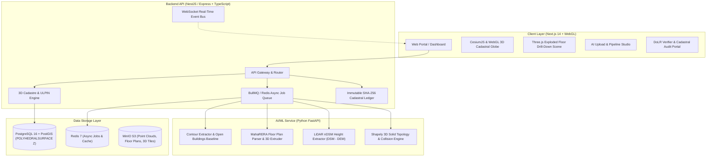

# 3D ULPIN Generation & Vertical Property Mapping System
### Ministry of Rural Development — Department of Land Resources (DoLR) | Smart India Hackathon #26011

[](https://github.com/)
[](https://github.com/)
[](LICENSE)

An enterprise-grade 3D Cadastral & Vertical Land Registry System designed to extend India's 14-digit Unique Land Parcel Identification Number (ULPIN) into the **third dimension ($Z$-axis)**. It establishes an unambiguous, legally traceable spatial framework for high-rise apartments, commercial towers, multi-tier basements, underground utilities, and elevated transit corridors.

---

## 1. The 3D ULPIN Standard Specification

India's existing 14-character base ULPIN identifies 2D surface parcels. The 3D ULPIN extension defines vertical and subterranean cadastral units:

$$\mathbf{\text{Format: }} \underbrace{\text{MH13BOM04521873}}_{\text{14-char Base ULPIN}} \cdot \underbrace{\mathbf{A}}_{\text{Domain}} \underbrace{\mathbf{+03}}_{\text{Level}} - \underbrace{\mathbf{B302}}_{\text{Unit}}$$

```
  MH13BOM04521873 . A +03 - B302
  └──────┬──────┘   │  │    └─ Unit Code (Flat/Suite/Utility Segment)
         │          │  └────── Level Code (Floor +03 relative to datum)
         │          └───────── Domain Code (A = Above Ground)
         └──────────────────── 14-character DoLR Base Parcel ULPIN
```

### Domain Codes & Vertical Levels

| Code | Domain Description | Level Code Range | Example Entity | 3D ULPIN Example |
|---|---|---|---|---|
| **`G`** | **Ground / Surface Parcel** | `00` (Plinth Datum) | Building Ground Atrium / Plinth | `MH13BOM04521873.G00-LOB01` |
| **`A`** | **Above-Ground Vertical Unit** | `+01` to `+99` | 3rd Floor Flat B302 | `MH13BOM04521873.A+03-B302` |
| **`U`** | **Underground Asset / Basement** | `-01` to `-99` | Water Main / Basement 2 Parking | `MH13BOM04521873.U-01-WSUP12` |
| **`T`** | **Transport / Elevated Corridor** | `+01`..`+99` / `-01`..`-99` | Metro Line 3 Tunnel / Flyover Pier | `MH13BOM04521873.T-06-MTR03` |

Each 3D cadastral record stores:
- **`geom`**: 3D Solid Geometry (`POLYHEDRALSURFACE Z` / `POLYGON Z` / `LINESTRING Z`)
- **`z_min`, `z_max`**: Precise vertical bounding elevations in meters relative to WGS84 MSL / Plinth Datum
- **`owner_id`, `owner_name`**: Cryptographic KYC / Aadhaar hash / Corporate Tax ID
- **`area_sqm`, `volume_cum`**: Built-up / carpet area ($m^2$) and 3D volumetric space ($m^3$)
- **`provenance`**: Source origin (`DRONE_LIDAR`, `MAHARERA_PLAN`, `BMC_GIS`, `GNSS_CORS`, `SYNTHETIC_DEMO`)
- **`validation_status`**: Topological state (`VALID`, `CONFLICT`, `PENDING_REVIEW`)

---

## 2. System Architecture



---

## 3. Scope: Demo Mode vs. Production Scaling Path

### Real in this Demo Build
- **3D Exploded Floor Drill-Down**: Real-time Three.js scene showing floating floor slices, color-coded room geometries, and interactive 3D ULPIN inspection.
- **Vertical Floor & Depth Scrubber**: Interactive slider dynamically peeling building storeys or slicing subterranean depth bands down to -30m.
- **Subterranean Utilities**: Accurate 3D linestrings/tubes for water, sewer, electric HV, gas, and metro tunnels beneath the terrain.
- **AI Floor Plan Extrusion**: Vectorizes sample MahaRERA layouts into 3D solid units with calculated carpet areas, volumes, and assigned 3D ULPINs.
- **LiDAR nDSM Height Profiling**: Digital Surface Model minus Digital Elevation Model computation.
- **3D Solid Topology Conflict Detection**: Real Shapely 3D intersection algorithm detecting the seeded vertical overlap conflict between Unit `A+02-201` and Unit `A+02-202`.
- **DoLR Verifier & Immutable Audit Trail**: Officers can review, clip, or reject unauthorized mezzanines with SHA-256 cryptographic audit logs.

### Production Scaling Path (Documented Architecture)
1. **Distributed Point Cloud Processing**: Deploy PDAL & Apache Sedona on Kubernetes for distributed processing of multi-gigabyte airborne LiDAR and drone photogrammetry.
2. **City-Scale 3D Tiles Streaming**: Generation of OGC 3D Tiles (b3dm / 3D Tiles 1.1) served via CDN for seamless navigation over entire municipal corporations (BMC, DDA, BBMP).
3. **MahaRERA & State Cadastre Interoperability**: Direct webhook integration with State RERA approval portals for zero-latency registration of approved high-rise unit geometries.
4. **Blockchain / Hyperledger Anchor**: Anchoring the SHA-256 audit ledger hashes to a national permissioned blockchain for legal dispute resolution.

---

## 4. Quick Start & Execution

### Option A: Docker Compose (One-Command Run)
```bash
docker compose up --build
```
This starts:
- **Next.js Web App**: `http://localhost:3000`
- **Backend API & Swagger Docs**: `http://localhost:4000/api/docs`
- **Python AI/ML Service**: `http://localhost:8000/docs`
- **PostGIS Database**: `localhost:5432`
- **MinIO S3 Console**: `http://localhost:9001`

### Option B: Local Standalone Development
```bash
# 1. Install dependencies
pnpm install

# 2. Run backend API
pnpm --filter @sih/api dev

# 3. Run frontend web application
pnpm --filter @sih/web dev
```

---

## 5. API Endpoints Reference

| Method | Route | Description |
|---|---|---|
| `GET` | `/api/v1/parcels` | List surface parcels |
| `GET` | `/api/v1/parcels/:ulpin` | Get parcel with linked 3D vertical units and utilities |
| `GET` | `/api/v1/ulpin/:id3d` | Resolve full 3D ULPIN record (e.g. `MH13BOM04521873.A+03-B302`) |
| `GET` | `/api/v1/underground` | List 3D subterranean utility conduits |
| `GET` | `/api/v1/search?q=...` | Universal search across ULPINs, owners, addresses |
| `POST` | `/api/v1/floorplans/upload` | Enqueue AI floor plan vectorization job |
| `POST` | `/api/v1/pointcloud/upload` | Enqueue LiDAR nDSM height extraction job |
| `GET` | `/api/v1/admin/conflicts` | List 3D topology validation conflicts |
| `POST` | `/api/v1/admin/conflicts/:id/resolve` | Adjudicate conflict (Approve / Reject) |
| `GET` | `/api/v1/admin/audit-logs` | Retrieve immutable SHA-256 audit ledger |

---

## 6. Seeded 3D Topology Conflict Demo

To demonstrate real-time 3D collision detection for the pitch:
- **Building**: BKC FinTech Pinnacle Tower (Floor +02)
- **Primary Registered Unit**: `MH13BOM04521873.A+02-201` ($Z = +8.80\text{m to }+12.60\text{m}$)
- **Colliding Encroacher Unit**: `MH13BOM04521873.A+02-202` ($Z = +11.20\text{m to }+15.00\text{m}$)
- **Violation**: **`ERR_3D_Z_OVERLAP`** (1.4m vertical solid overlap, 42.5 m³ collision volume).
- **Inspection**: Highlighted with red pulsing glow in 3D Exploded Viewer and actionable in the DoLR Verifier portal.
